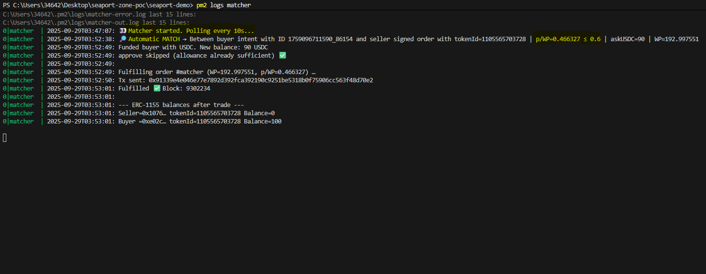

# MarketCreator PoC – WPERC1155 + Seaport (Sepolia)

## This repository contains several experiments and prototypes related to the MarketCreator platform:

1. PoC with Zone – first attempt to validate secondary market rules.
2. Local PoC (no Seaport) – orderbook logic, price ratios, and WP calculations.
3. Seaport Integration – full pipeline with real Seaport on Sepolia, including minting, listing, signing orders, and fulfilling.
4. Buyer Conditional Flow (new) – an automated matching system driven by buyer intents and a background matcher script. The matcher continuously monitors the orderbook and executes a trade automatically when buyer conditions are met.

The most important part is seaport-demo/. This folder demonstrates the complete pipeline for both buyer flows:
- Manual Path: Buyer selects and fulfills signed seller orders directly.
- Automated Path: Buyer defines a conditional intent (buyer-create-intent.cjs), and the matcher (matcher-run.cjs) runs continuously (optionally via PM2) to scan for matches and execute fulfillments automatically.

This PoC demonstrates how an off-chain matching layer can coordinate buyer conditions with seller orders while using Seaport purely as the execution engine.

---

## Requirements

- Node.js + Hardhat.
- An account with some ETH on Sepolia.
- Environment variables in .env:

```bash
SEPOLIA_RPC_URL=...
SELLER_PK=...
BUYER_PK=...
FUND_FROM_PK=...   # optional, to fund buyer with USDC
WP_ADDR=...        # deployed WPERC1155 address
USDC_ADDR=...      # deployed MockUSDC address
SEAPORT_ADDR=0x00000000000000ADc04C56Bf30aC9d3c0aAF14dC  # official contract on Sepolia
```

---

## Step-by-step flow

### Deploy


```bash 
npx hardhat run --network sepolia scripts/deploy-sepolia.cjs
```

- Deploys WPERC1155 and MockUSDC.
- Configures a vmId with tOpen, tClose, betaOpen, and outcomes.
- Saves addresses in deployments/sepolia.json.

### Mint positions (seller)

```bash 
npx hardhat run --network sepolia scripts/sepolia-mint-positions.cjs
```

- Mints multiple positions with different timeslot.
- Prints tokenId, amount, and β of each position to console.

### Scan holdings

```bash 
npx hardhat run --network sepolia scripts/sepolia-scan-holdings.cjs
```

- Detects seller balances.
- Generates data/listings.config.js with tokenId, amount, and a placeholder askUSDC_6dec.

### Edit prices

- Open data/listings.config.js.
- Manually adjust askUSDC_6dec (price in USDC with 6 decimals).

### Preview ratios

```bash
npx hardhat run --network sepolia scripts/preview-ratios.cjs
```

- Computes WP on-chain for each position.
- Shows USDC/WP ratios sorted from cheapest to most expensive.
- Adjust listings.config.js until satisfied.

### Sign orders (seller)

```bash
npx hardhat run --network sepolia scripts/seller-list.cjs
```

- Seller approves Seaport to move their ERC1155.
- Signs each order and saves them in data/orders.sepolia.json.
- Prints each signed order with its ratio.
- Generates a preview sorted by cheapest.

## Manual Path

### Buyer: list and/or fulfill

**To list without fulfilling:**

```bash
npx hardhat run --network sepolia scripts/buyer-fulfill.cjs
```

**To fulfill one specific order (e.g. the cheapest):**

```bash
BUY_INDEX=1 npx hardhat run --network sepolia scripts/buyer-fulfill.cjs
```

### Example output:

**ORDERBOOK (cheapest USDC per WP first)**


This shows clearly how the buyer acquires all units of the selected tokenId.

This is the manual route, where the buyer explicitly selects and executes a specific signed order.  
Below, we introduce the automated route, which shifts this decision-making off-chain and executes trades automatically when buyer-defined conditions are met.


## Automatic Path

```bash
npx hardhat run --network sepolia scripts/buyer-approve-usdc.cjs 
```

Grants the Seaport contract permission to spend the buyer’s USDC.
This step is required before any automatic fulfill can occur, since the buyer’s USDC must be available for transfer once a matching order is found.

- Calls approve() on the USDC token contract for the Seaport address.
- Ensures the buyer wallet is ready to execute future purchases without manual intervention.

```bash
node scripts/buyer-create-intent.cjs --vmid 1099511627776 --outcome "" --amount "" --maxpperwp "" --deadlinehours ""
```

Creates a new buyer intent – a JSON object describing the buyer’s conditions for an automated purchase.

It includes:

- buyer: Buyer’s wallet address
- vmId and outcomeIndex: The specific virtual market and outcome
- amount: Number of shares (WP) the buyer wants
- maxPricePerWP: Maximum acceptable price per Winning Power unit
- deadline: Expiration time for the intent
- status: Starts as ARMED (active)

Saves the new intent to data/intents.json, which acts as the source of truth for all active buyer conditions.

```bash
npx hardhat run scripts/matcher-run.cjs --network sepolia
```

The core of the automated buyer flow. This script runs continuously and monitors both intents.json and orders.sepolia.json (signed sell orders).
It matches a buyer intent with the best available seller order automatically when conditions are satisfied:

- Same vmId and outcomeIndex
- Same amount (no partial fills in the PoC)
- Seller’s price per WP ≤ buyer’s maxPricePerWP
- Seller still holds the tokens and has approved Seaport

Once a match is found:

1. It writes the matched order and buyer info to data/matched-order.json.
2. Spawns buyer-fulfill.cjs to execute the Seaport transaction on-chain.
3. Marks the intent as DONE and removes the consumed order from orders.sepolia.json.
4. Resumes polling for future matches.


**Data Artifacts in data/**

- intents.json – Stores all buyer intents. Each intent includes target VM, outcome, amount, price cap, deadline, and status (ARMED, EXECUTING, or DONE).
- matched-order.json – A temporary file created whenever a match occurs. It contains the signed seller order and the buyer address used in fulfillment. It is overwritten on each new match.
- matched-history/ – A directory containing a historical archive of all past matches. Each match is saved as a separate file with a timestamp in its filename, e.g., matched-2025-10-11T17-22-45.json.

**Running the Matcher in Background**

The automated buyer flow relies on matcher-run.cjs continuously scanning the orderbook. In production-like environments, we can run it persistently using PM2.

```bash
pm2 start ecosystem.config.js --update-env
pm2 logs matcher    # view logs
pm2 delete matcher  # stop matcher
```

PM2 ensures the matcher restarts automatically if the process exits and runs indefinitely without manual intervention. PM2 is optional but highly recommended: it keeps the matcher running continuously even after successful matches or temporary errors, which is crucial for a production-like setup.


### Example output:

**Automatic match**



This shows clearly buyer conditional flow in automatic way.

---

### Manual vs Automated Buyer Path – Quick Overview

| **Feature**         | **Manual Path**                                               | **Automated Path**                                             |
| ------------------- | ------------------------------------------------------------- | -------------------------------------------------------------- |
| Buyer action        | Selects and fulfills orders manually with buyer-fulfill.cjs   | Defines a conditional intent with buyer-create-intent.cjs      |
| Matching            | Buyer chooses which order to fulfill                          | matcher-run.cjs` scans continuously and matches automatically  |
| Fulfillment trigger | User runs buyer-fulfill.cjs manually                          | matcher-run.cjs spawns buyer-fulfill.cjs automatically         |
| Price logic         | Buyer checks price manually                                   | Matcher enforces maxPricePerWP condition                       |
| Process type        | One-off manual execution                                      | Continuous background process (optionally via PM2)             |
| Artifacts           | Uses orders.sepolia.json                                      | Uses intents.json, matched-order.json, matched-history/        |


---

## Notes

- The deployer and the seller of positions are the same address (from SELLER_PK).
- The buyer needs USDC to purchase. Transfer from FUND_FROM_PK or mint from MockUSDC.
- Business logic validations are performed off-chain (e.g., intent checks, price guards, token validity).
- Approvals (setApprovalForAll for ERC-1155 and approve for USDC) are included in the scripts.
- This PoC focuses on technical Seaport + WPERC1155 integration. No frontend is included; the console and JSON files (e.g., listings.config.js, orders.sepolia.json, intents.json) are used to observe the flow.
- The buyer flow now supports two modes:
   1. Manual Path: Buyer selects and fulfills a signed order manually using buyer-fulfill.cjs.
   2. Automated Path: Buyer defines a conditional intent, and matcher-run.cjs automatically finds the best matching seller order and executes the transaction.
- matcher-run.cjs can be run persistently in the background using PM2 for production-like behavior.

---

## References

- https://docs.opensea.io/docs/seaport-models?utm
- https://github.com/ProjectOpenSea/seaport-js
- https://docs.opensea.io/docs/seaport-interface?utm
- https://sepolia.etherscan.io/address/0x00000000000000adc04c56bf30ac9d3c0aaf14dc?utm


