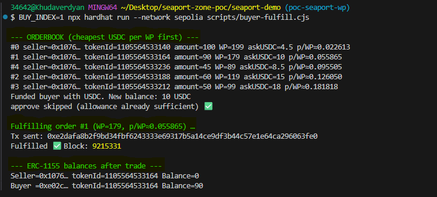

# MarketCreator PoC – WPERC1155 + Seaport (Sepolia)

## This repository contains several experiments related to the MarketCreator prototype:

1. PoC with Zone (first attempt to validate secondary market rules).
2. PoC local without real Seaport (orderbook logic, ratios, and WP).
3. Final PoC in seaport-demo/ folder. Full integration with real Seaport on Sepolia, including minting, listing, signing orders, and fulfilling.

The most important part is seaport-demo/. This folder demonstrates the complete pipeline we want to validate.

---

## Requirements

- Node.js + Hardhat.
- An account with some ETH on Sepolia.
- Environment variables in .env:

```bash
SEPOLIA_RPC_URL=...
SELLER_PK=...
BUYER_PK=...
FUND_FROM_PK=...   # optional, to fund buyer with USDC
WP_ADDR=...        # deployed WPERC1155 address
USDC_ADDR=...      # deployed MockUSDC address
SEAPORT_ADDR=0x00000000000000ADc04C56Bf30aC9d3c0aAF14dC  # official contract on Sepolia
```

---

## Step-by-step flow

### Deploy


```bash 
npx hardhat run --network sepolia scripts/deploy-sepolia.js
```

- Deploys WPERC1155 and MockUSDC.
- Configures a vmId with tOpen, tClose, betaOpen, and outcomes.
- Saves addresses in deployments/sepolia.json.

### Mint positions (seller)

```bash 
npx hardhat run --network sepolia scripts/sepolia-mint-positions.js
```

- Mints multiple positions with different timeslot.
- Prints tokenId, amount, and β of each position to console.

### Scan holdings

```bash 
npx hardhat run --network sepolia scripts/sepolia-scan-holdings.js
```

- Detects seller balances.
- Generates data/listings.config.js with tokenId, amount, and a placeholder askUSDC_6dec.

### Edit prices*

- Open data/listings.config.js.
- Manually adjust askUSDC_6dec (price in USDC with 6 decimals).

### Preview ratios

```bash
npx hardhat run --network sepolia scripts/preview-ratios.js
```

- Computes WP on-chain for each position.
- Shows USDC/WP ratios sorted from cheapest to most expensive.
- Adjust listings.config.js until satisfied.

### Sign orders (seller)

```bash
npx hardhat run --network sepolia scripts/seller-list.js
```

- Seller approves Seaport to move their ERC1155.
- Signs each order and saves them in data/orders.sepolia.json.
- Prints each signed order with its ratio.
- Generates a preview sorted by cheapest.

### Buyer: list and/or fulfill

**To list without fulfilling:**

```bash
npx hardhat run --network sepolia scripts/buyer-fulfill.js
```

**To fulfill one specific order (e.g. the cheapest):**

```bash
BUY_INDEX=0 npx hardhat run --network sepolia scripts/buyer-fulfill.js
```

## Example output:

### --- ORDERBOOK (cheapest USDC per WP first) ---



This shows clearly how the buyer acquires all units of the selected tokenId.

---

## Notes

- The deployer and the seller of positions are the same address (from SELLER_PK).
- The buyer needs USDC to purchase → transfer from FUND_FROM_PK or mint from MockUSDC.
- Approvals (setApprovalForAll for ERC1155 and approve for USDC) are included in the scripts.
- This PoC focuses on technical Seaport + WPERC1155 integration. No frontend is included; the console and JSON files (listings.config.js, orders.sepolia.json) are the way to view the flow.


